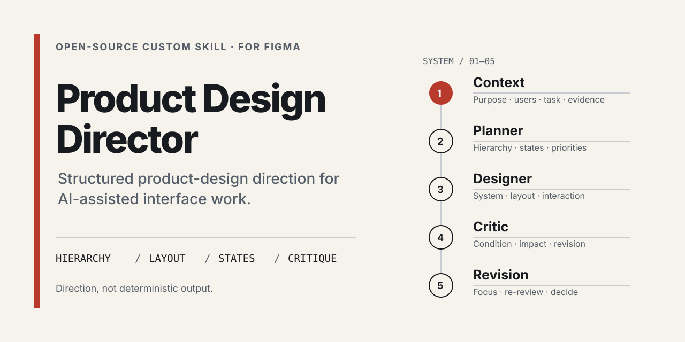

# Product Design Director

An open-source Custom Skill for structured product-design direction in Figma: visual systems, hierarchy, task-led layout, component states, responsive behavior, interaction, motion, accessibility review, and critique.

[Read the Skill](SKILL.md) · [Explore copyable examples](examples/README.md) · [Review current limitations](#current-limitations)

> **Community release pending.** No public Figma Community URL has been verified for this repository.



## Why this exists

AI-assisted interface work can drift toward generic card grids, weak information hierarchy, missing interaction states, decorative visuals, and desktop layouts that are merely compressed for mobile. Product Design Director gives the agent a structured set of design decisions and critique criteria to examine before and after it creates interface work.

It is written for product designers and AI product builders using the Figma agent or Figma Make on real product surfaces; design-systems practitioners can use its reference, component, and critique checks.

The skill provides direction. It does not claim to make every output distinctive, accessible, or correct.

## What the skill covers

- Product context, audience, task, brand evidence, and reference fidelity
- Visual identity, semantic color, typography, spacing, geometry, surfaces, and icon language
- Task-appropriate layout models instead of a default card or bento grid
- Component families and relevant default, hover, focus, selected, disabled, loading, empty, success, and error states
- Responsive prioritization that reflows or collapses secondary regions instead of simply shrinking a desktop frame
- Interaction feedback, purposeful motion, and reduced-motion variants
- Accessibility review guidance for contrast, focus, labels, target size, keyboard order, and non-color cues
- A critique pass that records the observed condition, user impact, and smallest reasonable revision

These are instruction areas in [`SKILL.md`](SKILL.md), not measured outcome claims.

## Quick start

Product Design Director is distributed as one standalone Markdown skill file.

1. Download or open [`SKILL.md`](SKILL.md).
2. In a Figma chat that supports custom skills, open **Skills → Add skill** and upload `SKILL.md`.
3. Review the imported name, description, and instructions before adding it.
4. Invoke `/figma-product-design-director`, then provide the product goal, users, primary task, content, constraints, and any authoritative reference.
5. Review the resulting frames, states, and critique; revise with product and implementation evidence.

The upload and invocation flow follows [Figma's custom skills guidance](https://help.figma.com/hc/en-us/articles/40283639496599-Custom-skills-for-the-Figma-agent-and-Figma-Make). This repository has not yet recorded a reproducible Figma import-and-run test.

## Copyable invocations

### Redesign an existing dashboard

```text
Use /figma-product-design-director to redesign this dashboard around the operator's primary task. Preserve the supplied content and brand references. Define hierarchy and region ownership before styling, choose a task-appropriate layout, cover the relevant interaction states, and finish with a critique that separates confirmed issues from optional explorations.
```

### Audit a product flow

```text
Use /figma-product-design-director to audit this product flow. Check purpose, information order, primary and contextual actions, component states, feedback, accessibility review points, and continuity between steps. For each issue, report the observed condition, user impact, and smallest reasonable revision.
```

### Adapt a desktop interface for mobile

```text
Use /figma-product-design-director to adapt this desktop interface for a mobile frame. Preserve the main task and brand evidence. Reconsider hierarchy, navigation, density, target sizes, panel priority, overflow, and reachable actions instead of shrinking the desktop composition.
```

More prompts cover [visual-system direction](examples/04-visual-system-direction.md) and [design critique](examples/05-design-critique.md).

## How the workflow operates

The skill defines staged planning, design, critique, revision, and final-critique passes:

1. **Context** — inspect purpose, audience, key tasks, content, brand evidence, and references.
2. **Planner** — define the goal, hierarchy, actions, states, density, responsive priorities, and exclusions.
3. **Designer** — translate the brief into visual-system and interface decisions.
4. **Critic** — review hierarchy, consistency, accessibility guidance, responsiveness, authenticity, and reference fidelity.
5. **Revision** — apply focused corrections, then re-review the complete flow.

Agent execution can vary; the staged instructions do not guarantee that a runtime will create independent subagents or deterministic output.

## Design principles

- Start from evidence and protect authoritative references.
- Set hierarchy before decoration and design around the real task.
- Use visual economy: every visible element should earn its place.
- Build sophistication through typography, proportion, spacing, alignment, and restraint.
- Reuse semantic variables, text styles, layout rules, and component families.
- Make important states clear without relying on color alone.
- Adapt by priority at narrow widths rather than compressing the wide layout.
- Preserve product authenticity instead of copying a familiar product template.

## Repository structure

```text
SKILL.md        Standalone Custom Skill instructions
examples/       Copyable prompts and a real-case template
assets/         Repository social preview
launch/         Channel drafts, gallery assets, metrics, and launch gates
.github/        Issue and pull-request templates
```

[`launch/preview.html`](launch/preview.html) is an offline review page for the generated visual assets. The files under `launch/` are source material for human-reviewed publication, not evidence that any external channel has been launched.

## Current limitations

- The skill provides design direction rather than deterministic output.
- Final results depend on the supplied context, references, content, model behavior, and agent execution.
- Accessibility guidance still requires implementation-level validation, assistive-technology testing where relevant, and human review.
- Product, brand, legal, and release decisions remain human responsibilities.
- No verified Figma Community URL, public case study, before/after comparison, testimonial, or reproducible import-and-run record is included yet.
- Figma supports standalone Markdown skill uploads; repository examples and launch assets are not bundled into the uploaded skill.

## Feedback and contribution

Use the [structured GitHub issue templates](https://github.com/Tmmy-inter/figma-product-design-director/issues/new/choose) for instruction problems, agent-execution problems, documentation defects, or feature proposals. Remove private product data and secrets before sharing a prompt, reference, or screenshot. See [`CONTRIBUTING.md`](CONTRIBUTING.md) for scope and review expectations.

## License and attribution

Released under the [MIT License](LICENSE). This is an independent open-source project and is not presented as an official Figma product. Figma is a trademark of its respective owner.
