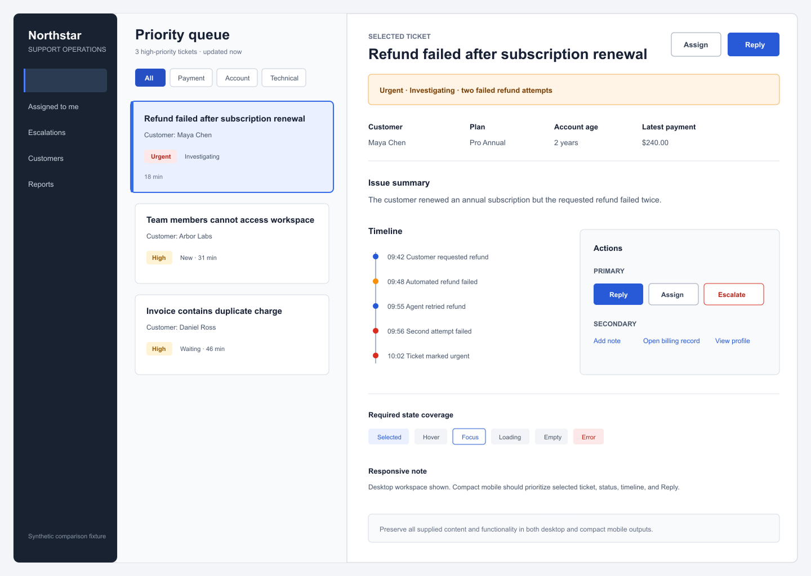
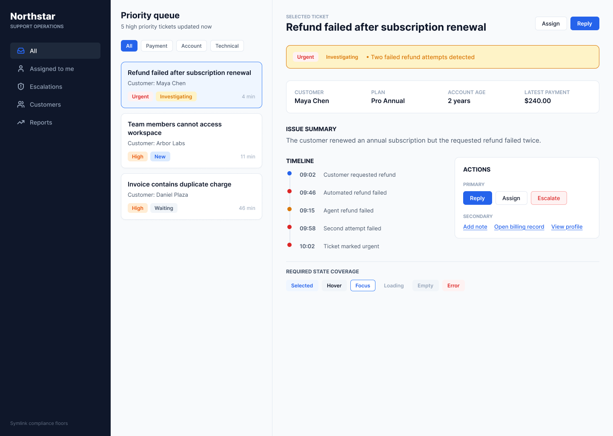
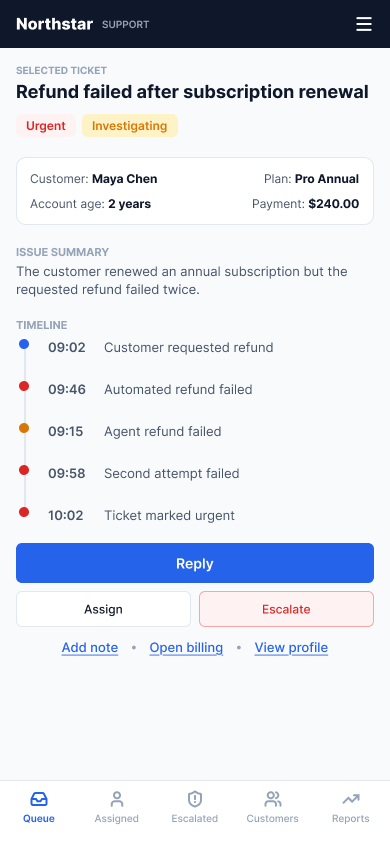
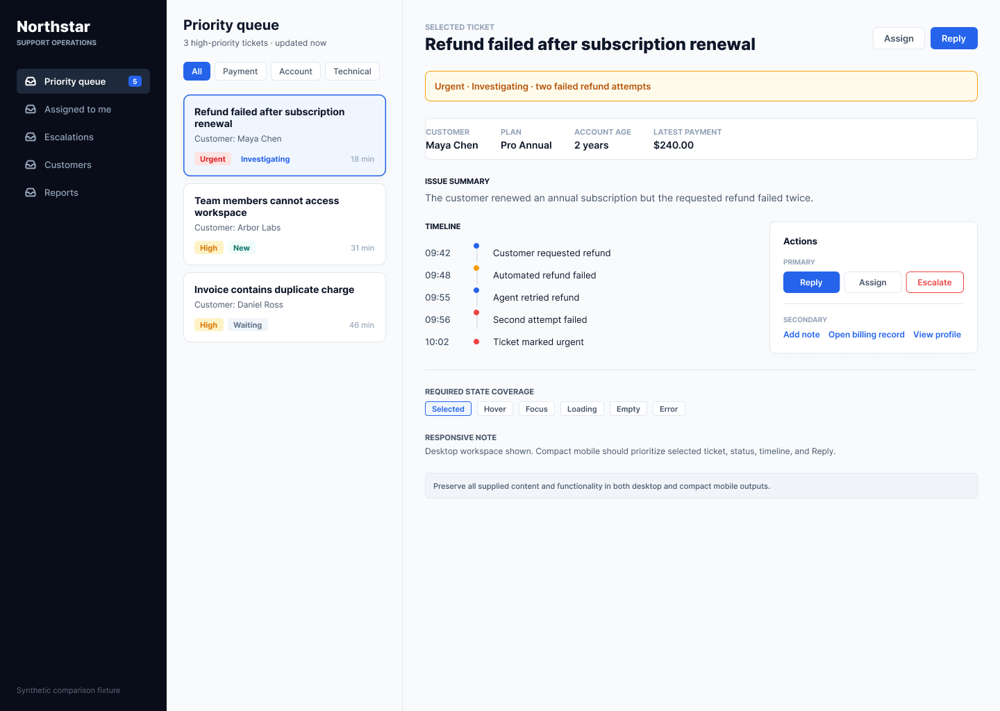
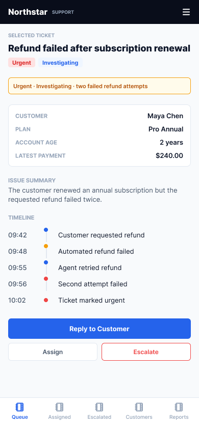

# Case study 01: support operations workspace

## Objective

Observe how one Figma Design agent run behaves with and without the repository version of `/figma-product-design-director` when asked to redesign the same synthetic support-operations workspace.

## Fixed variables

- Date: 2026-09-01
- Product surface: Figma Design agent
- Runtime: Figma Design agent default; the underlying model name was not exposed by the product UI
- Source: the same 1440 x 1024 synthetic `R2 Seed Desktop` frame
- Starting content, dimensions, selected-frame state, product brief, and output-size request
- One submitted task per condition; no operator correction or aesthetic rerun

## Planned variable

The skill-assisted condition included the canonical `/figma-product-design-director` skill context. The control condition did not. Because agent execution is non-deterministic, this planned variable is not strict causal proof.

## Seed

The seed contains a Northstar customer-support workspace with navigation, a three-ticket priority queue, a selected refund ticket, customer metadata, issue summary, five-event timeline, primary and secondary actions, six required state labels, and a responsive-priority note.

## Control

The control task used the exact brief without a skill context.

## Skill-assisted

The assisted task used the exact same brief and selected an identical duplicate of the seed, with `/figma-product-design-director` as the planned variable.

## Actual output

Both conditions created editable 1440 x 1024 desktop and 390 x 844 mobile frames. Both used a restrained operational interface, clear selected-ticket hierarchy, semantic status treatments, vertical timelines, action hierarchy, and mobile bottom navigation.

## Observed differences

- Both desktop outputs displayed all six requested state labels. These labels are planning evidence, not proof of implemented interactions.
- The assisted desktop retained the supplied timeline values, responsive note, and preservation note.
- The control changed four timeline values, one event label, the queue count, two ticket ages, and one supplied customer surname in the desktop export.
- The control mobile exposed the supplied secondary links; the assisted mobile did not show them in the visible 390 x 844 export.
- The assisted mobile retained exact timeline values; the control mobile did not.
- No material difference was observed in primary-task hierarchy, queue-to-detail continuity, component consistency, or functional-versus-decorative restraint.

See the [criterion-by-criterion evaluation](../evidence/r2/comparison/evaluation.md) for confidence and ambiguity notes.

## Failures

The control agent's first design-creation attempt failed, and the agent automatically retried inside the same task. No assisted creation failure was shown.

## Retries

- Operator retries: 0 for both conditions
- Control agent-internal retries: 1
- Assisted agent-internal retries: 0

## Human corrections

None. The assisted agent performed its own metadata-overlap correction inside the original task; the operator did not submit a corrective prompt.

## Limitations

- Agent execution is non-deterministic.
- One paired run is not statistical validation.
- The planned variable does not establish strict causality.
- The seed was a flattened synthetic image, which tests visual reconstruction rather than an editable production file.
- OCR and visual inspection can miss tiny text or clipped nodes.
- Neither mobile export visibly preserved every supplied secondary item.
- Accessibility-review labels are not implementation-level accessibility validation.
- Human design review remains required.

## Reproduction

1. Open a Figma Design file with access to the Figma agent.
2. Import [`seed-desktop.png`](../evidence/r2/comparison/seed-desktop.png), wrap it in a 1440 x 1024 frame, and duplicate it twice without editing.
3. Select the control duplicate and submit the prompt in [`control-prompt.md`](../evidence/r2/comparison/control-prompt.md) without a skill context.
4. Select the assisted duplicate in a new chat, add `/figma-product-design-director`, and submit the same prompt body from [`skill-prompt.md`](../evidence/r2/comparison/skill-prompt.md).
5. Retain the first completed outputs, including failures and internal retries. Export desktop and mobile frames natively at 1x PNG.
6. Compare against the supplied content and record both strengths and regressions.

## Evidence manifest

The machine-readable manifest, prompt hash, output hashes, timings, retries, and limitations are in [`run-manifest.json`](../evidence/r2/comparison/run-manifest.json). Full evidence is indexed in the [comparison directory](../evidence/r2/comparison/).
